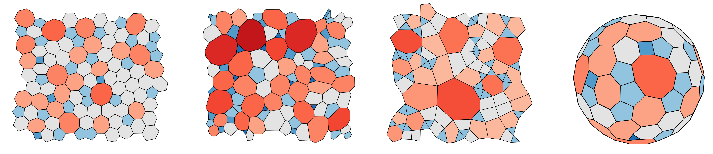

## 2D Network Monte Carlo

### Overview

This is a Monte Carlo code to generate amorphous 2D networks of physical systems.
These span a range of topologies, coordination environments and potential models.
The code also performs network analysis on the resulting structures,
and information for visualisation. 



### Compilation 

Compilation is easiest using CMake.
To compile the code execute the following in terminal:
```commandline
cd src/
cmake .
make
```
As the code is relatively computationally intensive, it is recommended that in the
```CMakeCache.txt``` you set ```CMAKE_BUILD_TYPE:STRING=Release``` before making.
You may also need to set ```CMAKE_CXX_FLAGS:STRING=-std=c++11```.

The generated executable is called ```netmc.x```.

### Input

The parameters for the calculation can be found in ```netmc.inpt``` which are read at runtime.
These are explained below:

```text
I/O
2:   /path/to/output/test
```
This is the path for the output files and the prefix. 
In this case output file ```test*.dat``` would be placed in the directory ```/path/to/output/```.
The exception is the logfile which is always placed in the running directory.
```text:
Network Properties
5: 92           number of rings
6: 3            minimum ring size
7: 20           maximum ring size
8: 3            minimum atom coordination
9: 20           maximum atom coordination
10: hexagonal    lattice (square,hexagonal,cairo,goldberg,inv_cubic,mix_X)
11: default      starting crystal (default,var1,var2)
```
These parameters set the fundamental properties of the network. 
The starting lattices can be:
* hexagonal: planar with 3-coordinate nodes
* square: planar with 4-coordinate nodes
* cairo: planar mixed 3/4-coordinate nodes
* mix_X: planar mixed 3/4-coordinate with the proportion of 3-cnd determined by X (e.g. mix_0.5)
* alt_square: planar mixed 2/4 coordinate nodes
* goldberg: spherical 3-coordinate ''football''
* inv_cubic: spherical 4-coordinate

The lattices impose some constraints on the allowable number of rings. 
The code may seg-fault if you put in a wrong number, sorry. 
Just leave the starting crystal as default, unless you are feeling very adventurous.

```text:
Monte Carlo Process
14: energy      run type (energy,cost)
15: mix         move type (switch/mix)
16: 2           random seed
```

Leave the run type as energy (cost function deprecated for now). 
The move type should be set as switch only if using a regular tiling and you want the coordination to be fixed.
The seed is for the Mersenne-Twister random number generator.

```text:
Monte Carlo Energy Search
19: 1       start temperature (10^x)
20: -3      end temperature (10^x)
21: -0.1    temperature increment (10^x)
22: 1.0     thermalisation temperature
23: 100     steps per temperature
24: 1000    initial thermalisation steps
```

The core algorithm is essentially simulated annealing. 
The starting crystal lattice is first randomised during thermalisation, at a given temperature and number of steps.
The lattice is then cooled from the start to end temperature with the supplied increment.
This along with the steps per temperature define a cooling rate.
It is possible to hack the algorithm for different studies.
For instance setting the thermalisation steps to zero will start the bond switching from the crystal.
Similarly setting the start and end temperatures equal will run at a set temperature.

```text:
Potential Model
43: 0.8     harmonic bond force constant
44: 0.2     harmonic angle force constant
45: 10.0    harmonic geometry constraint
46: 1       maintain convexity (0/1)
``` 

All bonds are modelled as harmonic springs with an equilibrium length of 1, and the supplied force constant.
Angles are cosine harmonic springs with an equilibrium angle dependent on their coordination, and the supplied force constant.
The geometry constraint is for playing with non-flat surfaces, where nodes are constrained to the surface by harmonic tethers.
Selecting to maintain convexity turns on the ReB angle potential, preventing rings from taking on non-convex geometries.

```text:
Geometry Optimisation
49: 1000        monte carlo local max iterations
50: 1           global minimisation max iterations
51: 0.5         tau backtracking parameter
52: 1e-06       tolerance
53: 5           local region size
```

These are geometry optimisation parameters which you can probably just leave.
The major one of interest is the local region size. 
As minimisation is expensive, and bond switching is inherently local, after each move only atoms within a given number of connections are minimised.
The convergence results from the minimisation are at the end of the log file, which should indicate whether the selected parameters are sensible.

```text:
Analysis
56: 1          analysis write frequency
57: 1          write sampling structures
58: 100        structure write frequency
```

The very minimalist analysis control: you will get what you're given and like it.
This controls how often the network is analysed, whether to write the sampling structures and how often.


### Runtime

Running ```netmc.x``` will read the input file and start the code. 
A log file, ```netmc.log```,
will also be produced which is quite verbose.

### Output

The code will produce output files in two categories: network description and analysis.
It will also continously produce a log file.

#### Network Description 

Networks consist of two linked dual networks.
Network A is the atomic network and B is the dual ring network.
Each output file is prefixed with the letter corresponding to each network.

* ```*_crds.dat```: coordinates of nodes
* ```*_net.dat```: links to nodes
* ```*_dual.dat```: associated dual nodes
* ```*_aux.dat```: geometry and additional information

Unless otherwise selected in the input file, only the final network will be written out.
Intermediate structures will be prefixed with a temperature and step index.

#### Analysis

The following analysis files are produced for each sample configuration:

* ```*_ringstats.out```: ring statistics
* ```*_cndstats.out```: atomic coordination statistics
* ```*_correlations.out```: assortativity, estimated AW alpha, AW alpha, AW variance, AW r-squared, atomic assortativity
* ```*_energy.out```: potential energy
* ```*_entropy.out```: Shannon entropy of node degree distribution, joint degree distribution, information transfer function of joint degree distribution
* ```*_temperature.out```: Monte Carlo temperature
* ```*_geometry.out```: sum of lengths, sum of squared lengths, average length, std. dev. of length, sum of angles, sum of squared angles, average angle, std. dev of angles
* ```*_areas.out```: sum of areas for each ring size; sum of squared areas for each ring size
* ```*_ematrix.out```: joint degree distribution
* ```*_cluster_*.out```: um, something about maximum number of connected nodes

The following analysis files are produced with data from all sample configurations:

* ```*_geomhist.out```: histograms of lengths and angles

#### Log file

Hopefull self-explanatory. 
One small important thing to note: at the end there will be a section on simulation diagnositics.
This will look something like:

```text
Simulation diagnostics
    Network consistent: 1
    Rings convex: 1
    Monte Carlo acceptance: 35.80000000
    Geometry optimisation codes:
        Converged:  510
        Converged (zero force):  0
        Unconverged:  0
        Failed (overlapping):  0
        Failed (initially non-convex):  0
    Geometry optimisation average iterations: 93.23725490
Diagnostics complete
```

After the simulation the code will check that the final network is fully consistent 
e.g. all connections are reciprocated, associated nodes in the network and dual match etc.
This is a good check for confidence in the code. 
If it is not 1 something bad has happened, and if you have been messing with the source code you have broken it!

The code also checks whether rings are convex.
If you have applied the ReB potential this should definitely be true.
Otherwise a false flag is acceptable.

Finally there is some information on the geometry optimisation routine.

### Visualisation

You will probably want to visualise the networks generated by the code at some point.
I have included two python scripts to help you get started with this.
They are really for my personal use, so good luck.

If you have a planar network run:
```python visualise_network.py prefix -flags```

If you have a fullerene network run:
```python 3d_visualise_network.py prefix -flags```

The flags are as follows:

* -ar: plot rings for network A
* -an: plot nodes for network A
* -arp: plot periodic rings for network A
* -arp -bn: plot periodic rings for network A and nodes for network B

That's ok for now: update with references and examples later.

DOM


